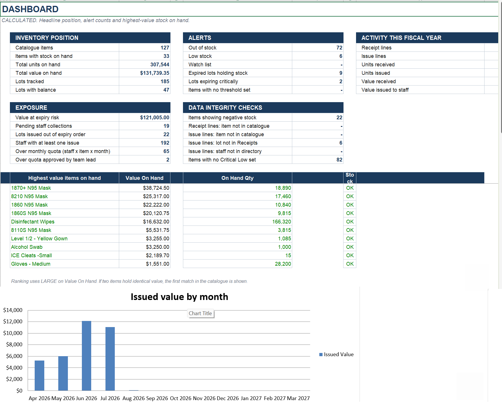
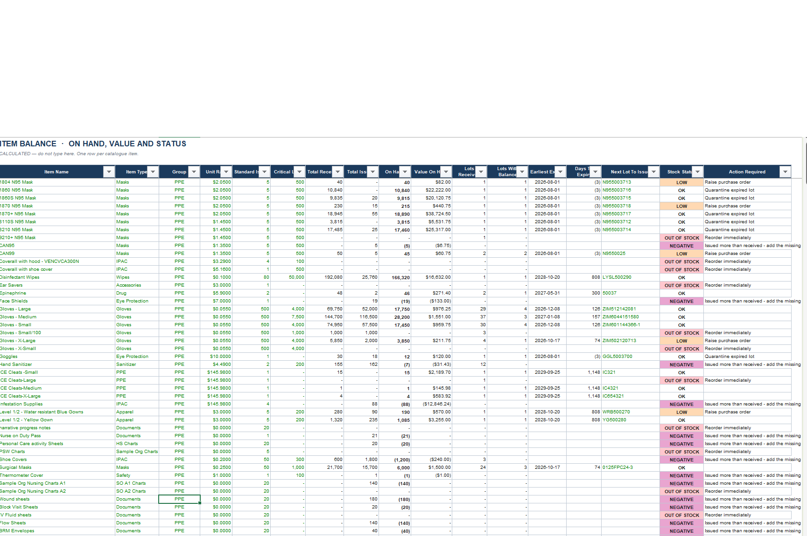
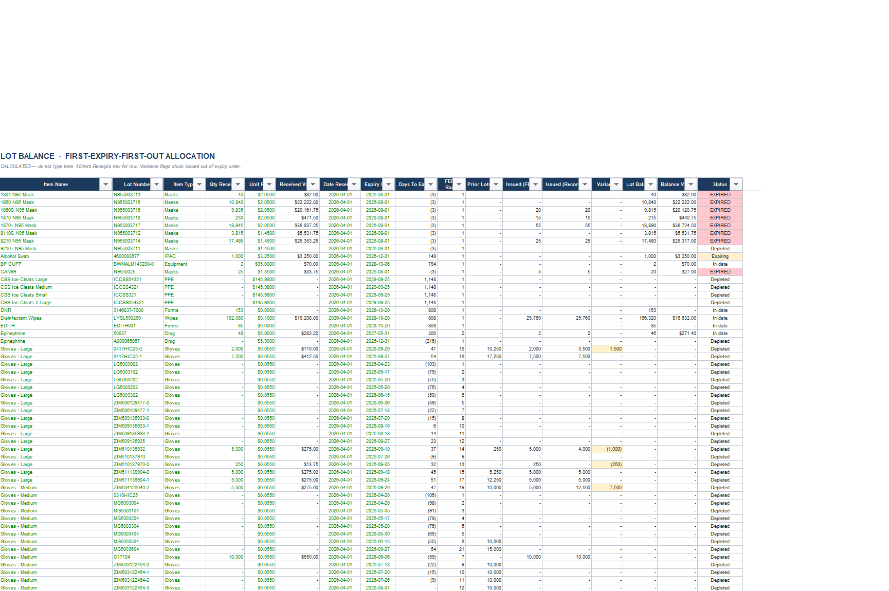
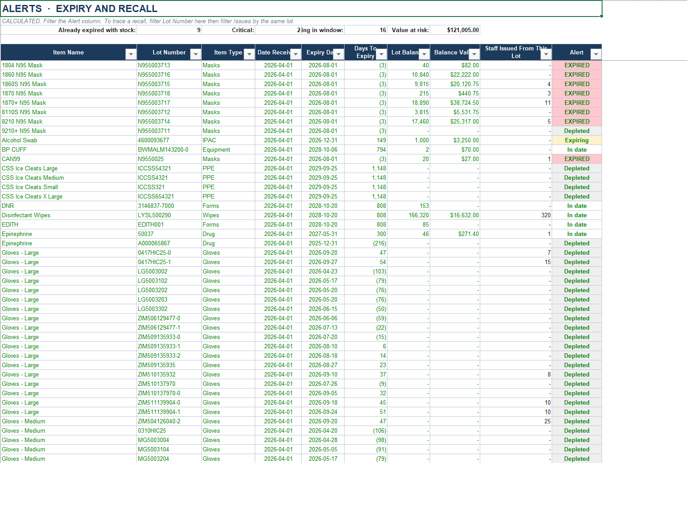

# PPE, Supply & Inventory Management System

A self-contained Excel inventory system for personal protective equipment and clinical
supplies. Every reporting sheet is driven by live formulas — **no VBA macros, no Power
Query, no external data connections.** Open it, type into an input sheet, and every
balance, alert, and dashboard figure recalculates instantly.

> **Demonstration copy — safe to publish.** All staff names, email addresses, vendor
> names, branch names, and the organisation name are synthetic placeholders. Staff are
> `Lastname###, Firstname###` and emails resolve to `example.com`.No real person, employer, patient, or supplier is identified, and no personal health information of any kind is present. Quantities, dates, rates, and costs are retained
> so the formula logic can be demonstrated end to end.

---

## Why it was built this way

The predecessor workbook used pasted Power Query output. Those sheets went stale the
moment anyone entered data and had to be manually refreshed — a recurring source of
wrong numbers. This rebuild replaces all of it with native formulas and Excel Tables, so
the workbook is:

- **Self-contained** — safe to keep on a network drive in a regulated environment
- **Auditable** — click any number and trace it in the formula bar
- **Zero-refresh** — no button to press, nothing to remember
- **Macro-free** — no security warnings, no trust prompts, no disabled content banner

## Scale of the demo dataset

| | |
|---|---|
| Catalogue items | 127 |
| Staff in directory | 266 |
| Vendors registered | 96 |
| Receipt lines (goods in) | 188 |
| Issue lines (goods out) | 1,931 |
| Lots tracked | 185 |
| Units received / issued | 583,554 / 276,010 |
| Value received / issued | $166,340.54 / $34,601.20 |
| Live formula cells | ~148,000 |

---

## Architecture

The workbook enforces a strict three-layer separation. **Never type into a calculation
sheet.**

```
INPUT sheets  ──▶  CALCULATION sheets  ──▶  DASHBOARD
(you type)         (formulas only)          (summary)
```

### Input sheets

| Sheet | Purpose |
|---|---|
| **Settings** | Alert thresholds, fiscal year start, lead times, quota multiplier, notice wording. Change a number here and every alert in the workbook retunes. |
| **Items** | Item catalogue — unit rate, standard issue quantity, critical low threshold. The master list every other sheet looks up. |
| **Staff Directory** | Staff name, role, area, contact. Staff ID and email are auto-generated formulas. |
| **Vendors** | Supplier and service-vendor register. |
| **Holidays** | Statutory holidays, consumed by `WORKDAY()` for pickup and reissue scheduling. |
| **Receipts** | Goods-in ledger — one row per lot received. Excel Table `tblReceipts`. |
| **Issues** | Goods-out ledger — one row per item dispensed. Excel Table `tblIssues`. |

### Calculation sheets

| Sheet | Purpose |
|---|---|
| **Lot Balance** | Per-lot balance with First-Expiry-First-Out allocation, days to expiry, and a recorded-vs-suggested variance check. Table `tblLotBalance`. |
| **Item Balance** | Per-item quantity and value on hand, stock status, earliest-expiring lot, next lot to issue. |
| **Alerts – Low Stock** | Items at or below their critical low threshold. |
| **Alerts – Expiry** | Lots inside the expiry alert window, or already expired. |
| **Alerts – Over Quota** | One row per staff × item × month where the monthly quota was breached. |
| **Staff Summary** | Per staff member: transactions, units, cost, last order, pending collections. |
| **Monthly Summary** | Received and issued quantity and value by month, quarter, and fiscal year. |
| **Dashboard** | Headline figures, alert counts, exposure, and built-in data-integrity checks. |

### Supporting sheets
**README** (in-workbook documentation) · **Change Log** (dated record of every build
decision) · **Office Supplies** and **Professional Services** (non-PPE orders and service
vendor engagements — input + calc hybrids).

---

## Key features

### FEFO lot traceability
Every receipt carries a lot number. Issues are allocated to lots on a
**First-Expiry-First-Out** basis, so a product recall can be traced from the vendor lot
all the way to each staff member who received it. `Lot Balance` shows both the lot that
was *recorded* and the lot FEFO *would have suggested* — a non-zero **Variance** means
stock left the shelf out of expiry order.

### Automatic alerting
Three alert sheets driven entirely from `Settings`:
- **Expiry** — 180-day warning window, 30-day critical window
- **Low stock** — trips at the item's critical low; `WATCH` at 1.25× that threshold
- **Over quota** — an item's Standard Issue Qty is the per-staff monthly limit

### Team-lead override workflow
An over-quota row turns pink across its full width. Set **TL Approval** to `Approved` and
the row turns green, reads `APPROVED BY TL`, and drops off the alert sheet. The
authorising person is recorded, and the Dashboard counts approved overrides separately
from open breaches. Pink outranks green, so a breach is never visually hidden by a
collected row.

### Auto-generated notice emails
The `Issues` sheet builds a ready-to-send staff notice per line. Roles listed in
`Settings` collect in person and receive the pickup notice; every other role receives the
dispatched/in-transit notice. A `HYPERLINK` formula builds a working **Draft in Outlook**
mailto link on every new row — again, nothing to refresh.

> Notice bodies are deliberately terse to keep the whole mailto URL under the 255-character
> limit `HYPERLINK` imposes. The longest link in the current dataset is 215 characters.

### Self-auditing dashboard
The Dashboard carries a **Data Integrity Checks** block that surfaces problems in the data
itself: items showing negative stock, receipt or issue lines referencing an item not in the
catalogue, issue lines quoting a lot that was never received, and issues against staff who
aren't in the directory.

---

## Daily workflow

1. **Goods arrive** — add a row to `Receipts`: date ordered, vendor, lot number, item name,
   quantity, expiry date, date received. Everything else fills itself.
2. **Item dispensed** — add a row to `Issues`: order date, staff name (dropdown), item,
   quantity, lot. Enter the Tracking ID once collected and Status flips to `Collected`.
3. **Check alerts** — open the two alert sheets and filter the Alert column to anything
   other than `OK`.
4. **Recall received** — filter `Lot Balance` to the recalled lot, then filter `Issues` by
   that lot to identify every affected staff member.

---

## Known limitations

| Issue | Detail |
|---|---|
| Thresholds incomplete | 82 of 127 catalogue items have no Critical Low set, so low-stock alerts can't fire for them. Those cells are highlighted yellow in `Items`. |
| Item name is the join key | Lookups match on item name text. Renaming an item in `Items` without updating `Receipts` and `Issues` breaks its history. An Item Code column is the proper fix. |
| Duplicate staff name | Two directory rows share an identical name, producing one duplicate auto-generated email address. |
| Fixed-extent sheets | `Office Supplies` (row 400) and `Professional Services` (row 202) are plain ranges, not Tables — they go dead below those rows. |

### ⚠️ Editing cautions
- **Never delete a `Receipts` row.** `Lot Balance` and `Alerts – Expiry` mirror it *by
  position*; deleting a row turns the matching mirror row into `#REF!`. **Clear the row
  contents instead.**
- **Never delete a Table object.** That erases its data and rewrites every structured
  reference in the workbook as `#REF!`.
- Save a file copy before any structural change.

---

## Requirements

Microsoft Excel 2019 or Microsoft 365 (desktop). Uses `SUMIFS`, `COUNTIFS`, `INDEX`/`MATCH`,
`WORKDAY`, `EOMONTH`, `EDATE`, `HYPERLINK`, structured table references, conditional
formatting, and data validation. No add-ins required. Google Sheets and Excel Online will
open it, but conditional-formatting fidelity and the mailto links are not guaranteed.

## Licence

MIT — see [LICENSE](LICENSE).
## Screenshots

**Dashboard** — headline inventory position, alert counts, exposure, and built-in data-integrity checks.



**Item Balance** — per-item quantity and value on hand, stock status, earliest expiring lot, and the next lot to issue.



**Lot Balance** — per-lot FEFO allocation with days to expiry and the recorded-vs-suggested variance check.



**Alerts – Expiry** — lots inside the alert window or already expired, with value at risk and how many staff received each lot.


